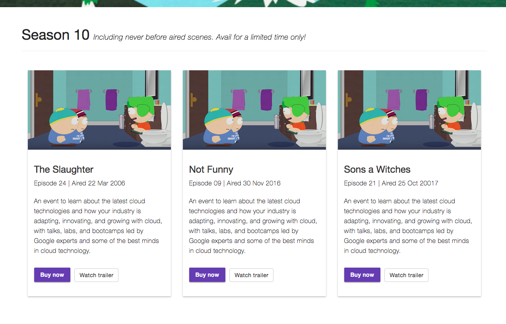
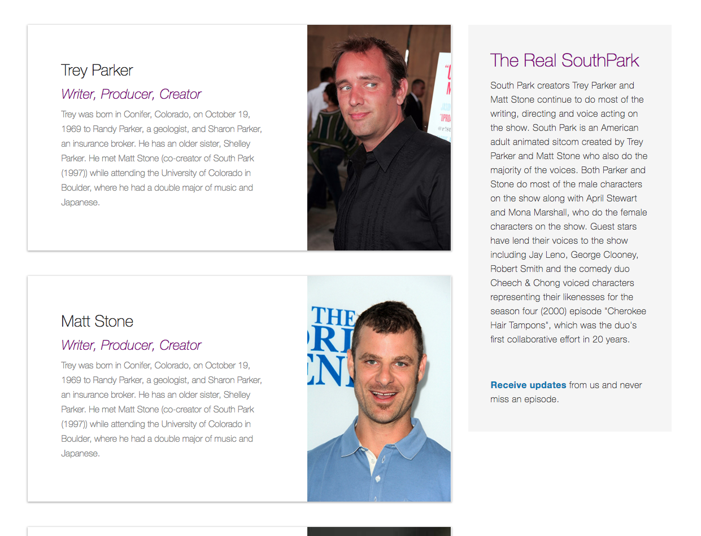
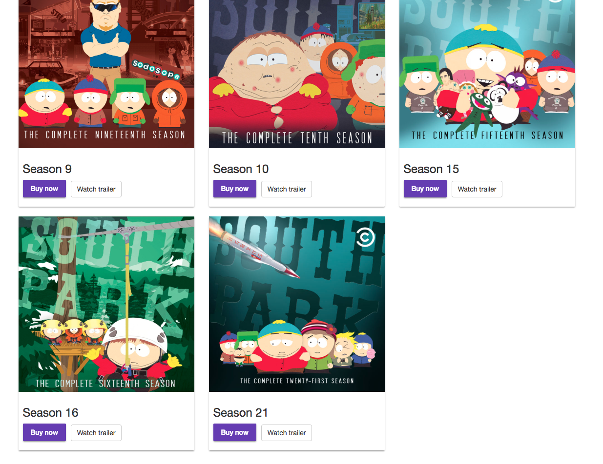
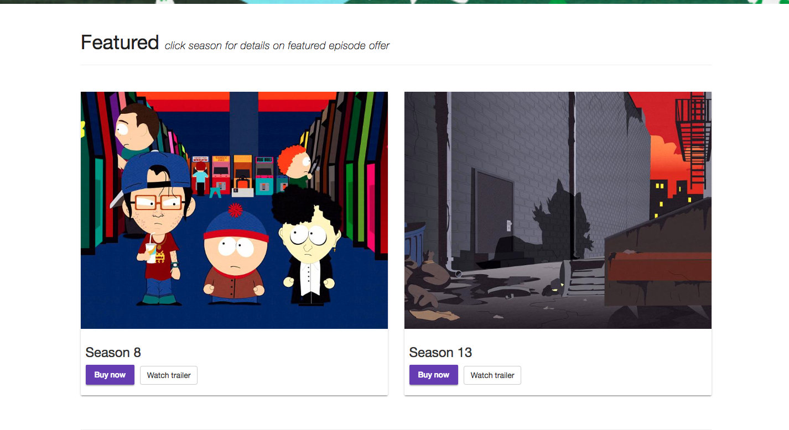

# Proj2

This project was generated with [Angular CLI](https://github.com/angular/angular-cli) version 6.1.1.

## Development server

Run `ng serve` for a dev server. Navigate to `http://localhost:4200/`. The app will automatically reload if you change any of the source files.

## Build

Run `ng build` to build the project. The build artifacts will be stored in the `dist/` directory. Use the `--prod` flag for a production build.

>

logs:  [___proj2___][`work-in-progress`]<kbd>[southpark]</kbd>

- fixed hammerjs path, lite-server other settings
- random component shared-data, service, now passing data in home page
- material module: matlist,matcard etc
- footer/header components
- bootstrap jumbotron, angular material main menu
- season10 component, service
- added comments object to shared data templates
- pages folder for all routing components
- added some css, cleaned up a bit
- using flex/bootstrap/material all together
- created featured component/details components
- existing episodes components now cast components
- routing module out - had problems with material module for some reason
- all paths within app.module now
- using input and ngif to pass data between random/details - home bottom
- home-featured now passing url params instead of using input - home top
- created cast component, added jsondata, created js object, cast-service,  
  images
- home page featured/random-seasons details wiring √           
..        
...         
- [tons left /free-styling]

 

 

 

 

 

 

 

 