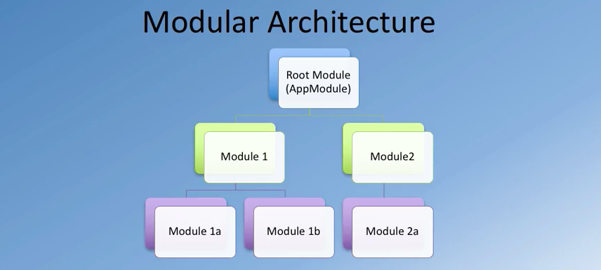
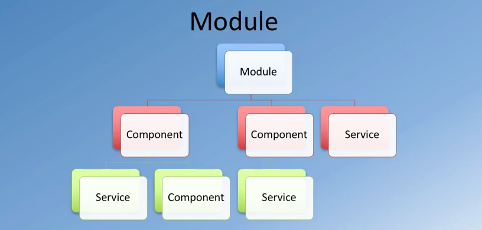
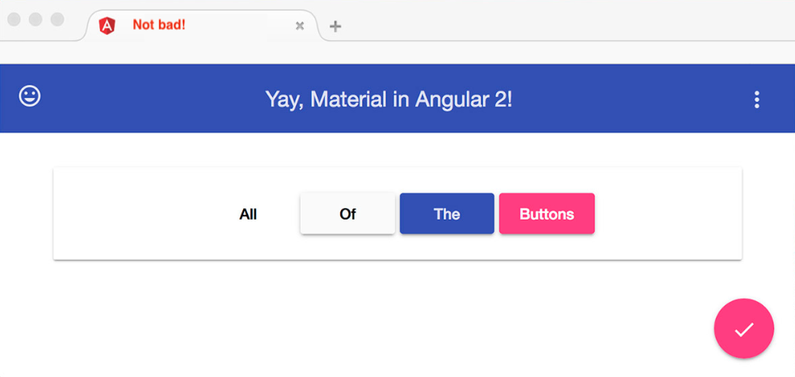

# software library

- collection of implementations of behaviour with a well-defined interface by
  which the behaviour is invoked.
- reuse of behaviour
- modularity
- e.g. jQuery


# software framework

- abstraction in which software provides generic functionality that can be
  selectively changed by additional user-written code.
- e.g. angular, ember, backbone


> angularjs designed by Misko Hevery (june, 2012)

## angular


- complete rewrite of framework
- designed with CRUD applications (data-driven) in mind
- component-based
- mobile support
- server-side rendering
- powerful templates

> `one-way/two-way data-binding`, components, `directives`, templates, `routing`, modules, `service`, provider, `testing`

### angular-cli
- https://cli.angular.io
- sudo npm install -g @angular/cli
- new proj: ng new folder --style=scss

#### angular material and flex-layout modules (new UI layout framework)
- similar to using bootstrap
- why not used bootstrap? you can also use bootstrap
  but you can only use the css components part of bootstrap within Angular
- jQuery/javascript-based components cannot be explicitly used. There can be
  some conflicts with code, so it is best to avoid using javascript components
  from Bootstrap inside your angular application.

```
   npm install --save @angular/material@latest

   //add to index.html:
   <link href="https://fonts.googleapis.com/icon?family=Material+Icons" rel="stylesheet" />
   
   //app.module
   import modules


   npm install --save @angular/animations@latest

   //use within angular for supporting some gestures
   npm install --save hammerjs@2.0.8

   npm install --save @angular/flex-layout@latest

```


### angular architecture
- files a combination of html and either typescript or javascript   
- modular
- component-based with templates
- services

> Modular architecture with a root module at the top, which takes the help of other modules organized into modular hierarchy.    
> Root module typically named app.module.

<br/>



### app.module

```
  imports: [
    BrowserModule,
    FormsModule,
    HttpModule
  ]

  //it's saying that all of these modules need to be imported in order to be used
    with the app.module as part of the hierarchy.
```

```
  declarations: [
    AppComponent
  ]

  //Declares the view classes that belong to this particular Angular module.
    So these view classes will be in the form of either:
    - components,
    - directives and
    - pipes

```


```
  providers: []

  //All the services that this particular module will make use of

```
<br/>



<br/>
<br/>

### angular material 2


<br/>



<br/>


```
  npm install --save @angular/material @angular/animations @angular/cdk
  npm install --save hammerjs (helps with touch support)

  //angular.json
  "scripts": [
    "../node_modules/hammerjs/hammer.min.js"
  ],

```

#### create MaterialModule.ts file

```
  import { NgModule } from '@angular/core';

    import {
      MatButtonModule,
      MatMenuModule,
      MatToolbarModule,
      MatIconModule,
      MatCardModule
    } from '@angular/material';

    @NgModule({
      imports: [
        MatButtonModule,
        MatMenuModule,
        MatToolbarModule,
        MatIconModule,
        MatCardModule
      ],
      exports: [
        MatButtonModule,
        MatMenuModule,
        MatToolbarModule,
        MatIconModule,
        MatCardModule
      ]
    })
    export class MaterialModule {}

    //then import module from root app module


    //to add a built-in theme (global css)
    @import '~@angular/material/prebuilt-themes/indigo-pink.css';

    //index file
    <link rel="stylesheet" href="https://fonts.googleapis.com/icon?family=Material+Icons">


```

## directives
- can be defined in angular as a class with the `@Directive` decorator
- directives give instructions to angular on how to render the templates    
  into the DOM.
- ***3*** types of ***directives***:
  + __components__ (special type with a template associated to it)
  + __structural__ directives
  + __attribute__ directives

### structural directives (dom manipulation)
- allow you to `add/remove` elements from the DOM
- you can use them by applying them to a host element such as a:
  + `div`
  + `li` (list item) ...and descendents (like with `*ngFor`)

- common structural directives:
  + `*ngIf`

```
  <div *ngIf="selectedEpisode">.....</div>

  // here you're specifying that `selectedEpisode` div not `null`
  // then this `div` will be added to the `DOM`

  // so if value returns false, then you're removing the element from
  // the DOM.

```

- `*ngFor`

- `*ngSwitch` -> selectively add elements to the DOM depending on what the
  the condition evaluated to


#### component template

- this is an object with a few propeties i did for the episode object.

```
    export EpisodeFormat {
      name: string;
      id: string;
      cover: string;
      season: string;

    }

    // it's just a class, and properties need to be typeof string
    // also you have to call all of its properties
    // doesnt have to be created in a file by itself but it's neat

```

- after that, I call the file from the file I'm created the object
- make a reference by:

```
    episodes: EpisodeFormat[]

    episodes: EpisodeFormat[] = EPISODES;


    //outside class
    const EPISODES = [.. ];


```

- another thing I liked is how the data object is outside of the class.
- here i can just declare a variable, const whatever and pass it on at the end
  inside of the class

- and if I need to set a default value at the start:

```
     selectedEpisode = EPISODES[0]; or
     selectedEpisode = this.episodes[0];
```

### about material module

- i choose using a separate module for  material in order to keep my
  material imports separated
- you gotta have to export these modules

```
    @NgModule({
  imports: [
    MatButtonModule,
    MatMenuModule,
    MatToolbarModule,
    MatIconModule,
    MatCardModule,
    MatListModule,
    MatGridListModule
  ],
  exports: [
    MatButtonModule,
    MatMenuModule,
    MatToolbarModule,
    MatIconModule,
    MatCardModule,
    MatListModule,
    MatGridListModule
  ]
})

```

> another thing I noticed while creating a new component, now that I had
  included both modules under a folder called modules is this:
  + i had to indicate which module.

  ```
      ex:
      ng g component mainMenu --module modules/app.module

  ```