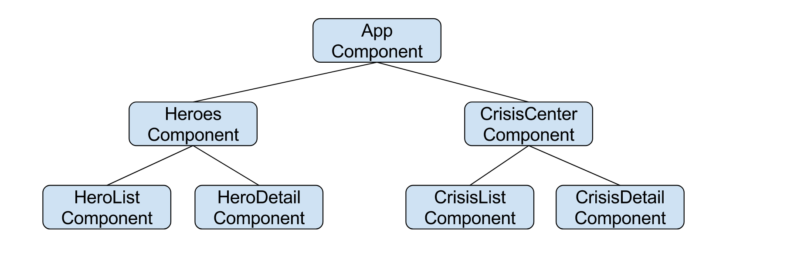
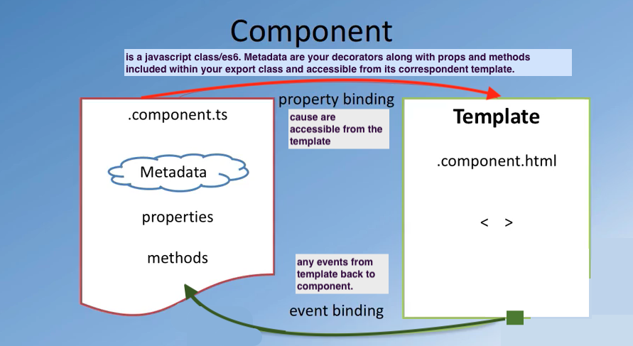

# components-based architecture

<br/>


<br/>


```
    import { Component } from '@angular/core';
    @Component({
      selector: 'app-div',
      templateUrl: './app-div.html',
      styleUrl: './app-div.css'
    })

    export class AppDiv {
      title: 'app-div works!';
    }

```


<br/>


<br/>