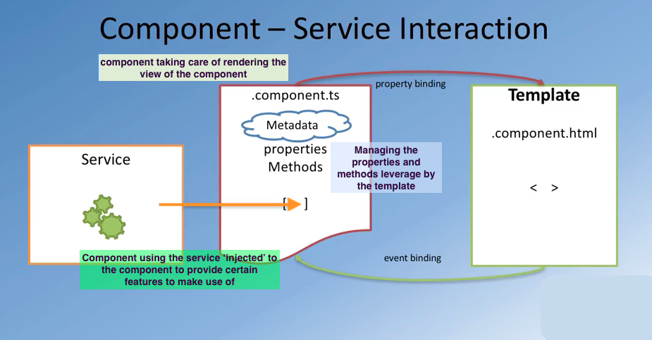

# angular services

## MVVM (model-view view-model)

<br/>


<br/>


> mainly they act as a mediator between the view and application logic


- services help to keep component classes lean
- they help with:
  + fetching data from server
  + user input validation
  + logging


<br/>



<br/>


## dependency injection

software design pattern that implements inversion of control for resolving
dependencies, where you have one object that is dependent on another object
in a way that is efficient.     
`Dependency` refers to an object that can be used by another objects (as a service) and `injection` refers to this object being passed without the need to build the object.     
Basically the object making use of it, does not need to worry about how the dependent object is being implemented, it just makes use of it.


### 3 ways for a component to make use of/ access its dependencies:
(if an object is dependent in another object)

1. it can create the dependent object itself by using the `new` operator

2. declare the other object as a global variable

3. to have the dependency passed into you.       
   (most flexible dependency does not need to be hardcoded)


@Injectable

```
    import { Injectable } from '@angular/core';
    import { Episode } ...

    @Injectable()
    export class EpisodeService {

      constructor() {

      }


    }//EpisodeService class


```
