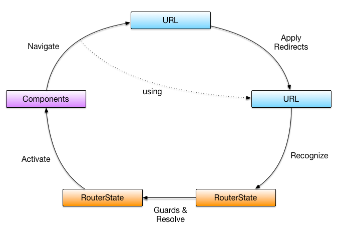

# angular routing
Angular router leverages HTML5 history manipulation to modify the browser URL

- enables navigation between `views`
- can also pass along optional parameters
- `router module` is separate from the angular core module and needs to be
  imported separately


### html5 (it uses the history api available in html5)
enables you to manipulate the history of your browser without causing a page
refresh.

- ability to `modify site's url without a full page refresh`
  + pushState(): Add history entry
  + replaceState(): Modify history entry
  + configure <base href="/">

```
  http://example.abc.com/home

  ..changed to:

  http://example.abc.com/menu

```

<br/>



<br/>


```
    - Router Module

      - Routes

        • { path: "/home", component: HomeComponent }

        • router Outlet
          …… <router-outlet></router-outlet>

        • routerLink directive
          …… <a routerLink="/menu">Menu</a>


```


