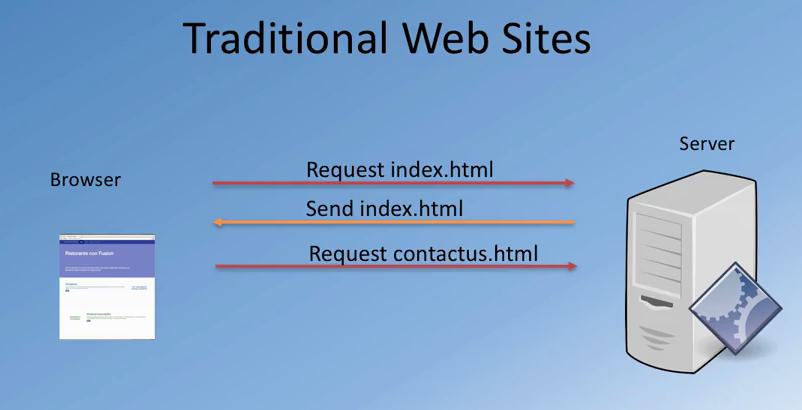
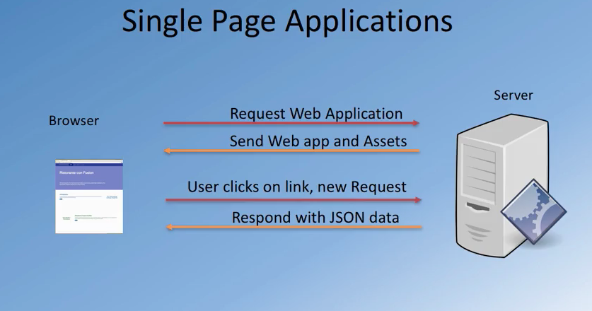

# spa

 

 

- single page app approach, single large download at the start, subsequent
requests are small, like download some json data for example. (most resources retrieved with single page load)  
- no need reload entire page (nor full-server roundtrip every-time)
- ux like desktop/native application

### challenges in spa

- search engine optimisation
- partitioning responsibility btw client/server
- maintaining history
- analytics (how-to collect data)
- speeding up initial page load (angular does partial-rendering in server-side)

 

 