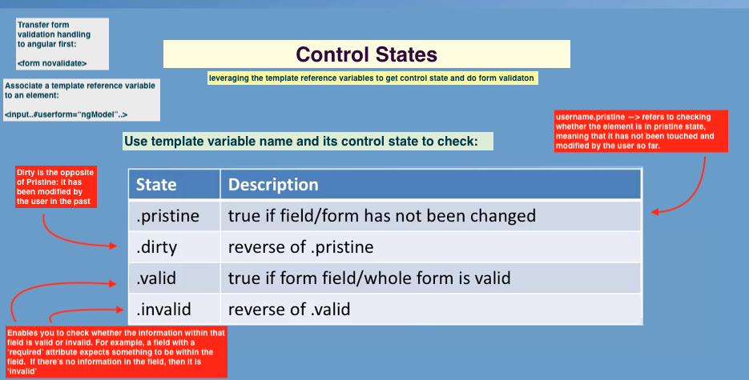

# form module template driven forms

- ng template driven forms and form validation within angular

## template-driven forms and reactive forms
- login, booking etc
- submit info, placing orders

### ng form support for 
- 2-way data binding,
- tracking
- form validation/error handling

### template-driven forms
- here we use the angular template and form elems to construct forms and
  make use of the angular support for these templates.
- bind elems to directives, 2way data binding with `ng-model`

### angular form validation
- first turn off HTML5 form validation so that form validation gets transfer
  to angular

```
    <form novalidate>

```

- angular template `reference variables`
  + reference variables can be specified for any element by associating 
    a ref var like this:

```
    <form novalidate #loginForm="ngForm">

    <input ... #username="ngModel" ...>

    // - template variables set to ngForm and ngModel give reference to
    //   the angular directive.
    // - then:

    //   • use them within the template to check for control states such as
    //     valid, dirty, errors


```

<br />



<br/>


#### ex: disabling the submit button
- to check if the form is in the valid state or not

```
    <button type="submit"...
            [disabled]="loginForm.form.invalid">Login</button>

    // so that when the form is invalid this button is disabled       

```

- for specific fields you can check whether the field is been filled or not

```
    // display error message: check if error of required type

    <mat-input-container 
         dividerColor="{{ password.invalid && 
                      !password.pristine ? 'warn' : 'primary' }}">

      <input... #password="ngModel" required>
      <mat-hint>
        <span [hidden]="password.pristine">
        <span [hidden]="!password.errors?.required">
              password is required</span>
        </span>
      </mat-hint>

    </mat-input-container>

```