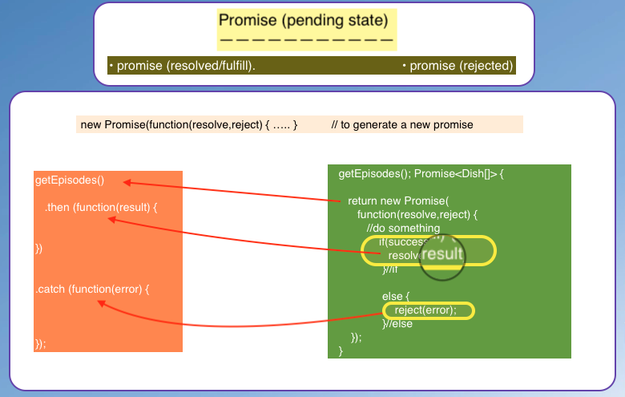

# ng-promises again
( simply put it: a value to be avail at a future time)
> A proxy object acts as an intermediary between the client and an accessible object.
> A proxy, in its most general form, is a class functioning as an interface to
  something else. 

- any server request would take sometime, so rather than waiting for whatever results, the need to proceed without having to wait for the server to get back at you, `is the Whole point`. (one way to explain a promise..nicer one below)

- a `promise` better described as a mechanism that supports asynchonous computation.
  A `proxy` for a value not necessarily known when the promise is created; but it represents a value that may be available now or in the future, or never.

A promise then ***returns*** a ***proxy object***; which is going to give you ***access to the results***, when they become ***available***.


### promise basics

- A promise when first received is on a `pending state`.
- When promise `resolves/fullfill` that is the results become available
  it moves from pending state to resolve or fulfilled state
- If promise `rejected` for whatever reason/error, then moves to the rejected state.


#### generate a promise

- new Promise(function(resolve,reject) { ... });




Promises can be helpful:
- promises solve the callback hell (nested callback) problem in node especially.
- promises can be chained

Also they can be immediately return:
  + Promise.resolve(result)
  + Promise.reject(error)


Here in ___Angular___ promises commonly used as a `way to deal with delays` as far as `getting data` from a ***server before*** being ***delivered*** to the 
***component*** through a ***service*** (although you can also use Promise.resolve and reject).... and up to when the promise is either ***resolved/rejected***.

### promise - with simulated delay within service

```
    //promise with 2s delay

  getBooks(): Promise<Book[]> {
    return new Promise(resolve => {
      //simulate server latency with 2sec delay
        setTimeout(() => resolve(BOOKS), 2000);
      });

  }//getBooks


  getBook(id: number): Promise<Book> {
    return new Promise(resolve => {
      setTimeout(() => resolve(BOOKS.filter((bok) => (bok.id === id))[0]), 2000);
    });

  }// getBook


```
