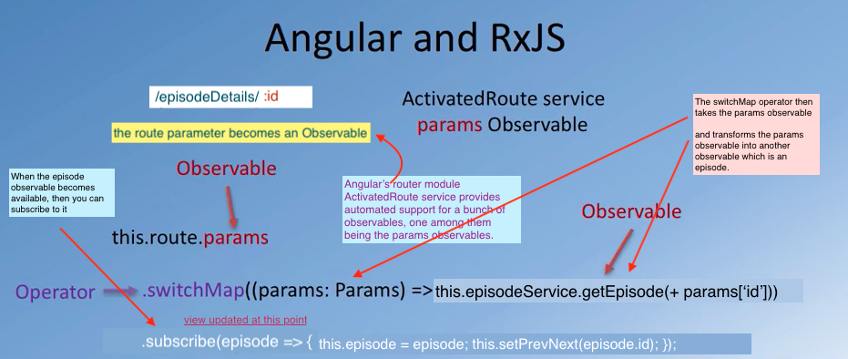

# RxJS

- The Reactive JavaScript Library: 
    + Observer pattern, 
    + Making use of observables to do Reactive Angular Applications.

- The Observer Pattern
  + Software engineering pattern
  + Reactive programming revolves around this particular pattern (Observables)

- So you have `observables`, whose behavior can be `observed` by `observers`.
  You declare certain objects as observables or subjects and these observables
  will be observed by observers.      
  The observable notifies `observers` of state changes. So whenever an observable
  observes a `change` in its `state`, it will immediately `notify all` the `observers`.   Observers, subsequently can take action based upon this notification of the  change in the observable. 

- `Data` based on `streams` (react to the value by subscribing to the stream)
- You can also unsubscribe to an observable.
- Cancelling and retrial with observables is very straightforward.

### reactive programming
- is based around the observer pattern
- in reactive programming we're interested in `data flows` how does data flow
  through your application (streams).
- built around streams
- `functional reactive` programming (functional + reactive)


### RxJS
- `RxJS` is a javascript implementation of the observable pattern and provides
   support for `reactive` programming.
- RxJS is just one implementation of reactive programming - there are others,
  but this is the one used by Angular.
- `RxJS` library for composing asynchronous and event-based programs by using
  observable sequences.
- RxJS provides:
  + one core type called Observable,
  + satellite types (Observer, Schedulers, Subjects), and
  + operators inspired by Array#extras(map,filter,reduce,every etc)
  + this is what allows you to handle asynchronous events as collections.


```  
     ____________
     |           |      [ a,            b,         c,           d ] 
     | Observable|________∫____________∫__________∫____________∫________
     |___________|        |            |          |            |
                          |            |          |            |
                          |            |          |            | 
                       ---------------------------------------------
                       |            Operators                      |
                       |___________________________________________|
                     

      --------->       creating new observables of transformed values
                       themselves become a new stream

```                       

### observables all over angular:
- forms
- http
- asyncPipe
- change detection


<br>



<br/>


<br/>


<br/>


