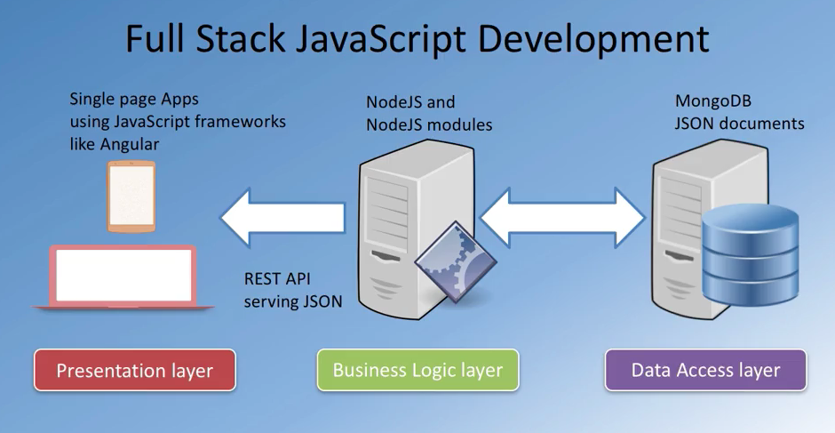
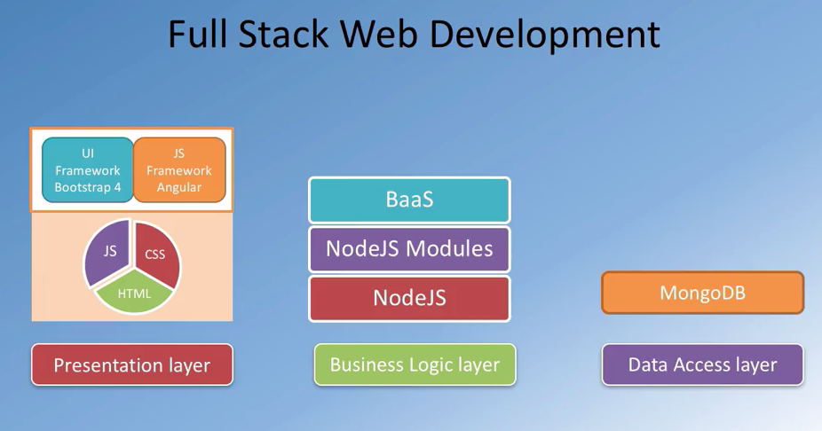
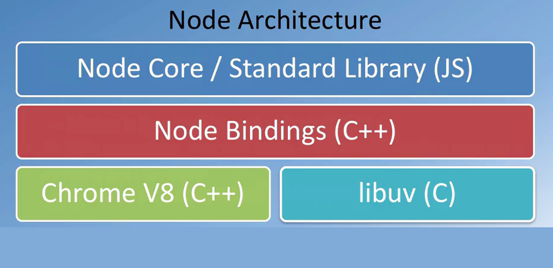

# full-stack-javascript dev

 

## node.js && npm  /runtime

- js runtime built on Chrome v8 javascript engine
- event driven, non-blocking i/o model

 

- npm: manages ecosystem of node modules/ packages
- a package contains:
  + js files
  + package.json (manifest)
- npm init

