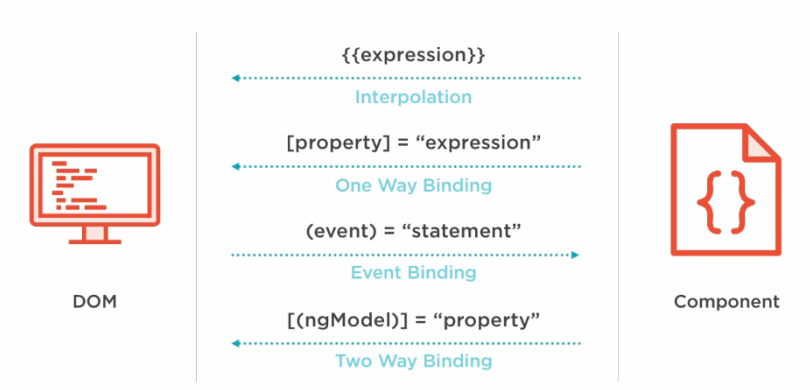
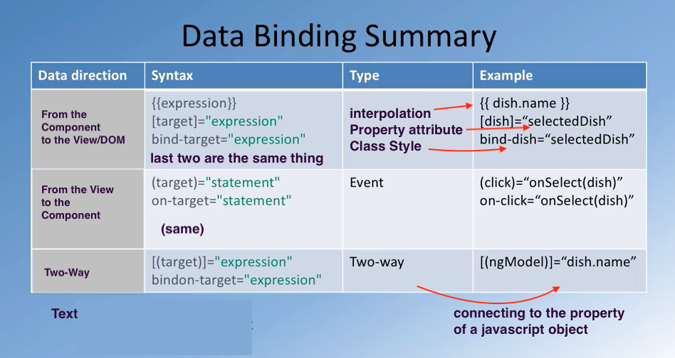

# data-binding
data-flow from/to template - component

- information flow between component and its template
- interpolation
- property attribute
- event binding
- two-way data binding

<br/>



<br/>

In the component you got two main parts the typescript file where the component architecture is defined (metadata, properties, methods), and
then you have the template that defines how the content is lay out and
added into the Dom.


### 4 types of data binding

- data flowing from component to template. Here you have `{{ someValue}}`
  from the component being rendered in the template.

- another case, where you specify some kind of a property associated with a
  tag in square brackets. `[property]="value"` where value is the value from
  one of your component's properties.

- dom event that call a handler/method inside your component `(event)="handler"`

- two-way data-binding: `[(ngModel)]="property"`. Forms


<br/>



<br/>

### binding targets

- these are the properties that are declared on the left side of the 
  binding declaration:          
  
  ` ([..]), (...), [(...)] `


- right side is the binding source:     

  ` ("...") `

- target properties must be marked as `Input` or `Output` properties using
  decorators:

 ```
    @Input() episode: Episode (to send info from one comp to another)
    
    @Output() deleteEpisode = new EventEmitter<Episode>();

    //here with output you can specify an event from one component being
    //passed back to another component 

 ``` 

> if you define target properties associated with the selector of the 
  component, that's one way to passing information into the component,
  or sending back information from one component to another component.